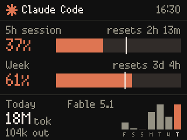
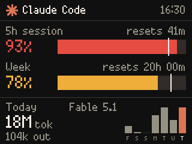

# pico-claude

[](https://github.com/seesee/pico-claude/actions/workflows/tests.yml)

A Raspberry Pi Pico 2 W with a Pimoroni Pico Display (320x240 LCD) that shows
Claude Code usage: the 5-hour session limit, the weekly limit, and today's
token count with a seven-day chart.

 

Each limit bar shows the percentage used and when the window resets. The white
marker on a bar is the pace line: how far through the window you are. Fill
past the marker means you are burning faster than an even pace. Bars turn
amber at 70% and red at 90%.

## How it works

```
each host running Claude Code                      this Mac
┌──────────────────────────────┐        ┌───────────────────────────────┐
│ statusline-tee.sh  (limits)  │        │ PicoClaude menu bar app       │
│ publisher.py   (transcripts) │─MQTT──►│  + its own transcripts/limits │
└──────────────────────────────┘        │  merges all hosts             │
   claude/hosts/<hostname>              └──────────────┬────────────────┘
                                             claude/usage (retained)
Home Assistant etc. ── unicorn/control/onoff ──►  Pico ◄──┘
```

* **Agent** (`agent/`, Python stdlib only, Linux or macOS). Runs on every
  other host you use Claude Code on. Token counts come from the transcripts in
  `~/.claude/projects`. The plan limits are only exposed in the JSON that
  Claude Code passes to the statusline command, so a small shim wraps the
  existing statusline command, saves that JSON, and passes it through
  unchanged. The shim also starts the publisher, which exits again after
  three minutes without statusline activity. Each host reports to its own
  retained topic.
* **App** (`app/`, Swift). A menu bar app on one Mac. It reads that Mac's own
  transcripts and limits, subscribes to every host report, merges them and
  publishes the result for the Pico. The menu bar shows the 5-hour percentage;
  clicking it shows the same view as the Pico, a per-host breakdown, and a
  switch for the Pico display.
* **Device** (`device/`, MicroPython). Subscribes to the merged topic and the
  control topics, and redraws when data arrives or the minute changes.

Merging rules: token counts are summed across hosts (hosts report hourly
buckets, and days are cut in the Mac's timezone). The limits are account-wide,
but every session only knows them as of its own last response, so the best
reading across all sessions and hosts wins: the latest window, and within it
the highest percentage.

Limits are only refreshed when a Claude Code terminal session somewhere gets a
response. When the Mac is asleep nothing is merged; the Pico keeps the last
reading, counts the reset timers down itself, rolls "Today" over at midnight,
and shows the age of the data in the header (for example `47m ago`) once it is
older than 15 minutes.

## MQTT

| Topic | Payload | Effect |
|---|---|---|
| `unicorn/control/onoff` | `ON` / `OFF` | backlight on / off (same topic as unicorn_wrangler) |
| `unicorn/control/onoff` | `ONAIR` / `OFFAIR` | full-screen ON AIR banner / back to usage |
| `unicorn/control/cmd` | `RESET` | reboot the Pico |
| `claude/usage` | JSON, retained | merged usage, published by the app |
| `claude/hosts/<hostname>` | JSON, retained | one host's report, published by its agent |

Topic names can be changed in `device/config.json` (`mqtt.topic_*`).

Merged payload:

```json
{"v":1, "ts":1790868907, "tz":3600,
 "h5":{"pct":4.0, "reset":1790886000, "ts":1790868907},
 "d7":{"pct":1.0, "reset":1791342000, "ts":1790868907},
 "today":{"tok":2715421, "out":63204, "msgs":28},
 "week":[0,89991,0,0,17777385,0,2715421], "model":"Fable 5.1"}
```

`h5` / `d7` are absent until Claude Code has reported limits (Pro/Max plans
only, after the first response in a session). `tok` counts input, output and
cache tokens, like ccusage's total; `week` is oldest first, today last.

Host report (`hours` rows are `[unix_hour, model, tokens, output_tokens, messages]`):

```json
{"v":2, "host":"buildbox", "ts":1790870870,
 "h5":{"pct":4.0, "reset":1790886000, "ts":1790870860}, "d7":null,
 "hours":[[497464,"claude-fable-5-1",272639,5203,6]]}
```

To drop a host that is gone for good, clear its retained report:
`mosquitto_pub -h <broker> -r -n -t claude/hosts/<hostname>`.

## Buttons

* **A** toggles the display on and off.
* **B** cycles brightness.

## Setup

Device (needs Pimoroni MicroPython firmware and `mpremote`):

```sh
cp device/config.example.json device/config.json   # set wifi + broker
tools/deploy.sh
```

Menu bar app, on one Mac (needs Xcode). codesign needs the login keychain: in a
Terminal window on the Mac it just works; over SSH run
`security unlock-keychain ~/Library/Keychains/login.keychain-db` first.

```sh
app/install.sh        # build, sign, copy to /Applications, start
```

It signs with the identity in `app/build.sh` (override with
`PICO_CLAUDE_SIGN_IDENTITY`). On first launch macOS asks whether PicoClaude
may find devices on the local network; allow it. The broker address is picked
up from `~/.claude/pico-claude/config.json` if present, or set under Settings
in the panel, where "Launch at login" also lives. `install.sh` wraps
`statusLine.command` in `~/.claude/settings.json` (backup at
`settings.json.pico-claude.bak`).

Agent, on every other host (copy the `agent/` directory there; needs python3):

```sh
agent/install.sh <broker-ip>            # start the publisher on demand from the statusline
agent/install.sh --daemon <broker-ip>   # Linux: also keep it running (systemd user service)
agent/uninstall.sh
```

Use `--daemon` on hosts where you run Claude headless (`claude -p`), since the
statusline only fires in the terminal interface. Do not install the agent on
the Mac that runs the app, or its usage is counted twice.

## Development

```sh
python3 -m unittest discover -s tests     # agent + hardware-free device code
(cd app && swift test)                    # app core: scanner, merge, MQTT framing
app/.build/debug/PicoClaude --snapshot panel.png   # render the menu bar panel with sample data
tools/screenshot.py --all                 # render sample scenes on the Pico -> screenshots/
tools/screenshot.py --live                # run the real app for 20s and capture it
python3 agent/publisher.py --dry-run      # print this host's report
tools/logs.py                             # follow the serial log (needs pyserial)
```

`tools/screenshot.py` runs the code from `./device` on the board without
copying it, and reads the frame back from the display framebuffer, so the PNG
is exactly what the panel shows.

Layout:

```
device/main.py        entry point
device/cc/app.py      wifi, mqtt, ntp, buttons, render loop
device/cc/ui.py       drawing
device/cc/amqtt.py    small asyncio MQTT client (non-blocking, reconnects)
device/cc/fmt.py      formatting and time-window logic (pure, tested)
agent/usage.py        transcript scanning, hourly buckets
agent/publisher.py    publish loop
agent/statusline-tee.sh  statusline shim
app/Sources/PicoClaudeCore   scanner, merge, MQTT framing (tested)
app/Sources/PicoClaude       menu bar app
```

## License

MIT, see [LICENSE](LICENSE). This is an unofficial project and is not
affiliated with or endorsed by Anthropic.
